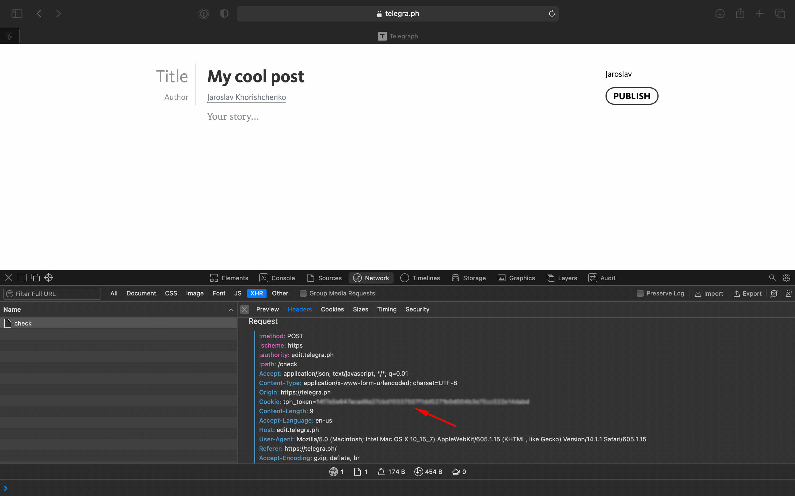

# Telegraph CLI


CLI tool for [telegra.ph](https://telegra.ph/) blog platform.

## Installation

```bash
npm install -g telegraph
telegraph --help
```

Or use with `npx`:

```bash
npx telegraph-cli --help
```

## Usage

To use private methods (e.g. `cratePage`) you have to set an access token:

```bash
telegraph setAccessToken %token%
```
You can find it at the cookies of the website or you can create a new one by using `createAccount` method.



List posts:

```bash
telegraph getPageList
```

Get specific post:

```bash
telegraph getPage --path=Puteshestvie-po-Namibi --return_content
```

Create post from markdown file:

```bash
telegraph createPage --title="My awesome post" --content=content.md
```

Get more information about a specific command by using `-h` or `--help` flags:

```bash
telegraph createPage --help
```

## Contacts

Jaroslav Khorishchenko

[jaro@smartapp.dev](mailto:jaro@smartapp.dev)

